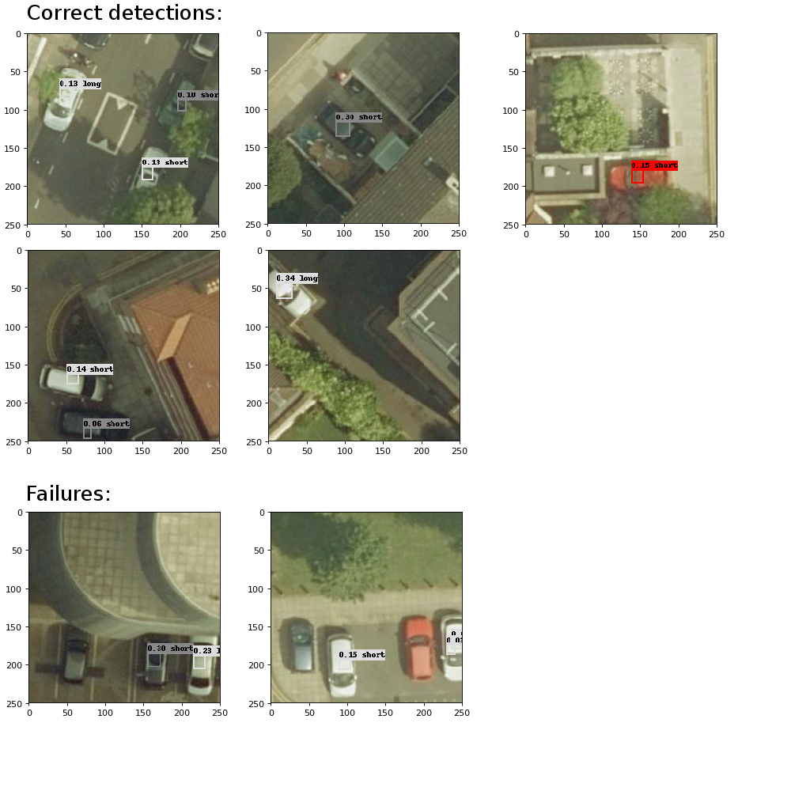

# Object detection on satellite images

YOLO/YOLOv2 inspired deep neural network for object detection on satellite images. Built using Tensorflow. Keys features:
- the model is using an architecture similar to YOLOv2 (batch_norm after each layers, no fully connected layers at the end).
- We predict only one box per feature map cell instead of 2 as in YOLO.
- No passthrough layer is used. Predictions are based only on the last layer.
- There is no Imagenet classification pretraining. The full loss is used from the start.
- The input images are 250x250 instead of ~450x450. Results should improve with a bigger image size.
- The learning rate is kept constant throughout training.

## Installation

Dependencies: `pip install -r requirements.txt`

The **dataset** is/was available on https://www.datasciencechallenge.org/challenges/1/safe-passage/ . `preprocess.py` lets you transform the 2000x2000 images into 250x250 images and a CSV file with all the objects annotations. The dataset contains only the position of the center of the objects (**no bounding boxes**). A bounding box is generated. It's just a square centered on the provided position (x,y). The size of the square varies depending on the type of vehicle.

## How to use

Train the network with :
`python main.py --logdir=logs/ --batch_size=64 --ckptdir=checkpoints/`

Inference (it will randomly select 10 images and draw bounding boxes):
`python detect.py`

## Example

We're using **8 object classes**: Motorcycle, Light short rear, Light long rear, Dark short rear, Dark long rear, Red short rear, Red long rear, Light van. Other types of vehicles are **ignored**.

After training for **100 epochs**, you will get the following. The results are generally OK. However some cars are sometimes not detected (for example the red car at the bottom) or found in position with no vehicles. mAP has not been calculated.

